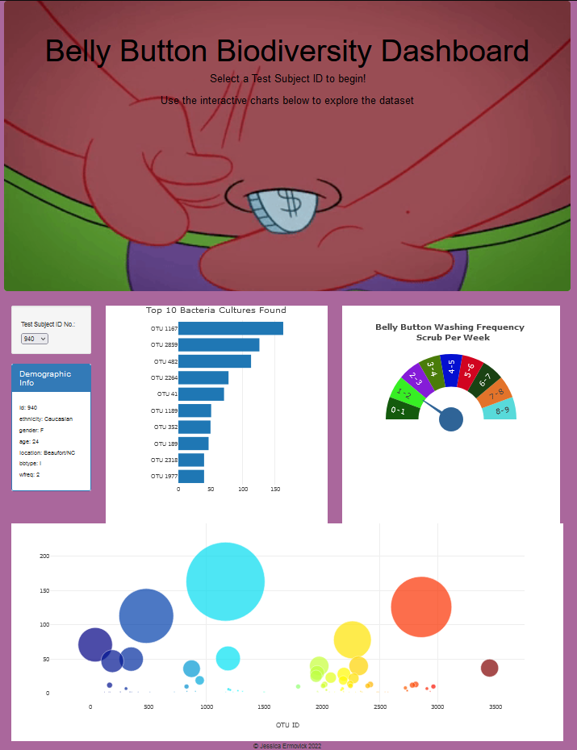
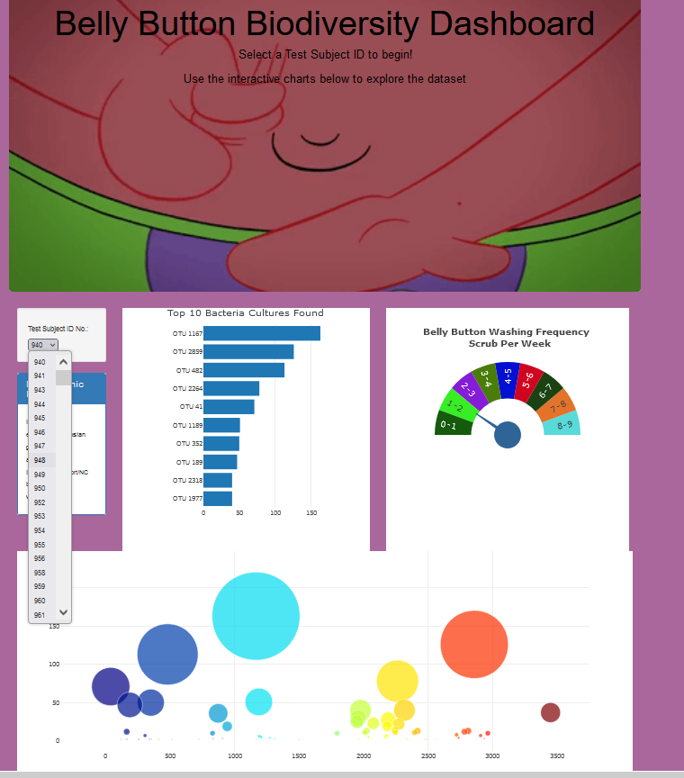
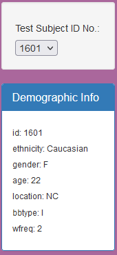
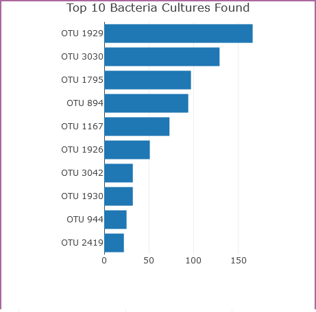
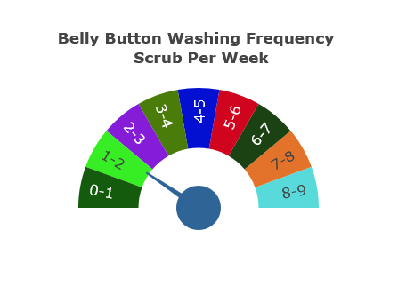
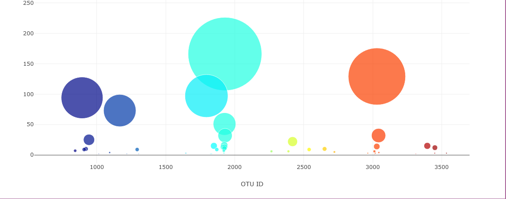
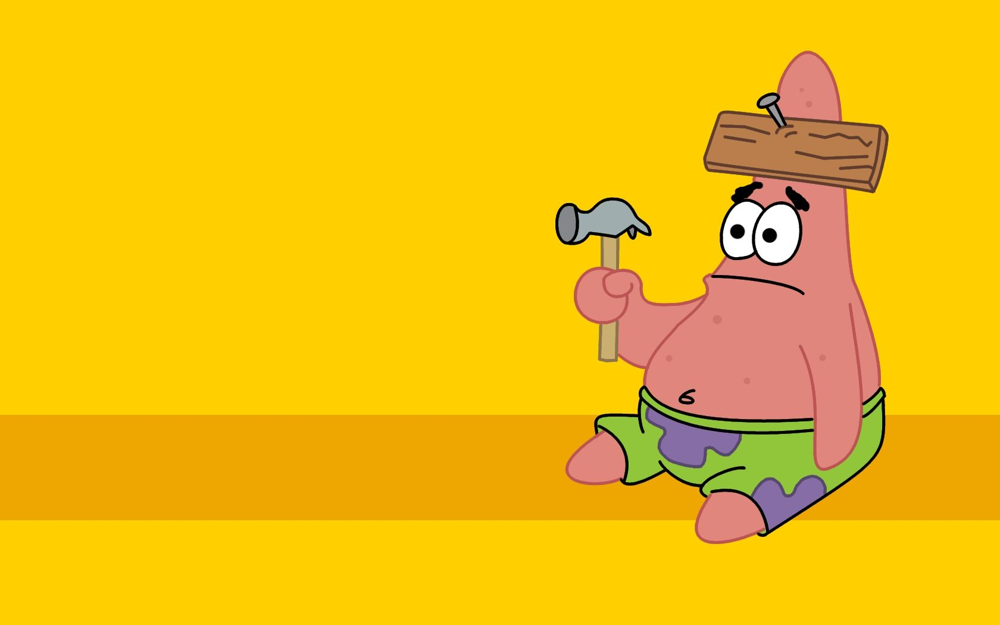

# Plotly Challenge - Belly Button Biodiversity

## Summary
This project stems from the work done at the Rob Dunn Lab in NC State University: [Belly Button Biodiversity dataset](http://robdunnlab.com/projects/belly-button-biodiversity/), which works to catalog the microbes that are present within the human belly button.

Finished hosted application can be found: [HERE!](https://jermov.github.io/BellyButtonBiodiversity/)

### General Info: Finished Application
The dashboard opens with the first row of data loaded to provide a visualization upon initialization:
 

 From there, an end user can use the drop down to select a subject id and the dashboard will refresh with the data from that subject id:
 

 ## Tools
These are the tools, techniques, and resources used in this project.

* Plotly is used in combination with D3 and Javascript for visualization of dataset

* HTML is used to build out the page

* Github Pages hosts the web application

* The data imports from a json file

### About the Data

Hulcr, J. et al.(2012) _A Jungle in There: Bacteria in Belly Buttons are Highly Diverse, but Predictable_. Retrieved from: [http://robdunnlab.com/projects/belly-button-biodiversity/results-and-data/](http://robdunnlab.com/projects/belly-button-biodiversity/results-and-data/)

## Project Steps 
I decided to break the project into three steps. The first was to get the web page set up, the second was to create the plotly charts and the logic for changing the subject id, and the third was to create the logic for the gauge refresh. I placed all visualization refresh functionality within the bonus.app file to more easily troubleshoot issues during coding. There were many, many issues.  

### Step 1: Page Layout 
Simply used the provided starter code for the html file. This provided me the template for the website without needing to find the perfect template that would accomodate the charts.  

### Step 2: Plotly chart creation and selector 
The app.js javascript specifies the layout for each chart as well as the variables used to create the charts.   
The Selector Drop down that updates the demographic information, charts and gauge upon selection:  
 
The bar chart lists the top ten microbe types within the subject id selected: 
 
The frequency gauge indicates the number of times a subject washed their naval in a week: 
 
The bubble chart gives a visual overview of the microbe count within each subject id: 
  
### Step 3: Gauge and chart refreshes 
The bonus.js gives functionality for the gauge. Part of my troubleshooting found that in creating the functionality of the gauge, I lost the refresh abilities of the other charts. This caused some code overlap within the bonus.js to ensure when a subject id is selected that the data refreshed within the charts. This corrected the lost bubble and bar charts on selection change, but added possible unnecessary code. Plan to return to this when time permits to better troubleshoot the issue.  
### At the end of the project, after all the issues of lost charts as I attempted to implement gauge refresh capabilities I was left feeling a little like: 

